# Hybrid Geothermal sCO₂ Power System with PV and Battery Integration

### Python based thermodynamic optimization, recuperator analysis, start up assessment and hybrid renewable dispatch

<p align="center">
<strong>Supercritical CO₂ • Geothermal Energy • Brayton Cycle • Recuperation • CoolProp • PVGIS • Battery Storage • Python</strong>
</p>

---

## Project Overview

This repository presents an engineering model of a **geothermal supercritical CO₂ Brayton power cycle** and extends the thermodynamic model into a **hybrid geothermal, photovoltaic and battery energy system**.

The project is structured as a complete engineering workflow:

**component thermodynamics → cycle calculation → pressure optimization → recuperator analysis → off design behaviour → quasi steady start up → PV resource modelling → battery dispatch → grid interaction**

The model is implemented in Python using **CoolProp**, **NumPy**, **Pandas**, **Matplotlib** and **pvlib**.

---

## Engineering Objectives

The project addresses six main questions:

1. How does high pressure influence net power and thermal efficiency?
2. Which low pressure and high pressure combination gives the strongest cycle performance?
3. Under what conditions is recuperation physically useful?
4. How does the plant respond to changing pressure, mass flow and turbine inlet temperature?
5. How does the cycle behave during a simplified start up ramp?
6. How can geothermal generation be combined with PV and battery storage to reduce grid dependence?

---

## Integrated System

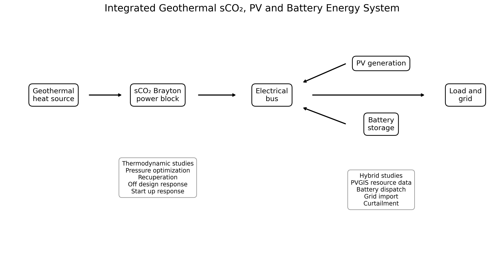

The geothermal sCO₂ power block provides firm generation. PV adds variable renewable electricity, while the battery shifts PV surplus and supports the load when instantaneous renewable supply is insufficient.

---

## Corrected Recuperated sCO₂ Cycle

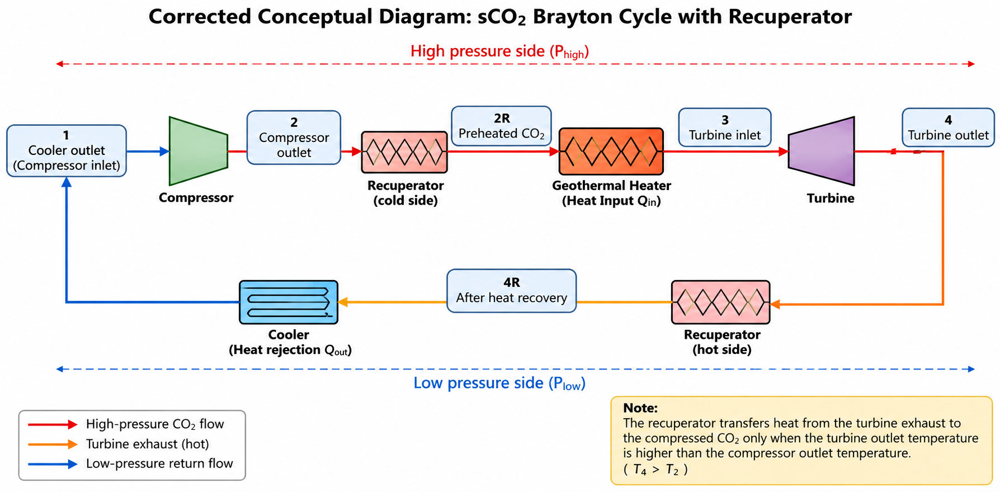

The recuperated cycle is represented as:

```text
Cooler outlet
    ↓
Compressor
    ↓
Compressor outlet
    ↓
Recuperator cold side
    ↓
Geothermal heater
    ↓
Turbine
    ↓
Recuperator hot side
    ↓
Cooler
```

The recuperator transfers heat from the turbine exhaust to the compressed CO₂ only when:

```text
T4 > T2
```

where `T4` is turbine outlet temperature and `T2` is compressor outlet temperature.

---

## Model Design Point

| Parameter | Reference value |
| --- | ---: |
| Working fluid | CO₂ |
| Compressor inlet temperature | 35 °C |
| Turbine inlet temperature | 150 °C |
| Selected low pressure | 85 bar |
| Selected high pressure | 160 bar |
| CO₂ mass flow | 20 kg/s |
| Compressor isentropic efficiency | 0.80 |
| Turbine isentropic efficiency | 0.85 |
| Recuperator effectiveness | 0.80 |

The selected pressure ratio is approximately:

```text
160 / 85 = 1.88
```

---

# 1. Thermodynamic Cycle Model

The model evaluates real compressor and turbine states from isentropic reference states using CoolProp.

## Compressor

```text
h2 = h1 + (h2s - h1) / eta_c
```

## Turbine

```text
h4 = h3 - eta_t (h3 - h4s)
```

## Net specific work

```text
w_net = w_t - w_c
```

## Net power

```text
W_net = m_dot × w_net
```

## Thermal efficiency

```text
eta_th = W_net / Q_in
```

Detailed equations are available in:

`docs/model_equations.md`

---

# 2. High Pressure Optimization

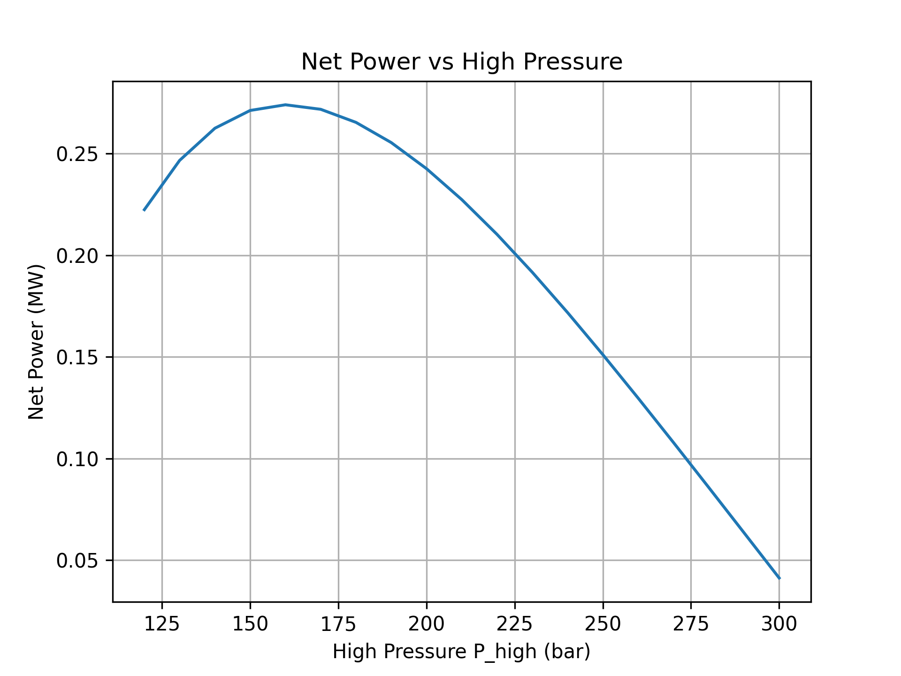

Net power does not increase indefinitely with high pressure.

At first, increasing pressure improves turbine expansion work. Beyond the optimum region, compressor power rises strongly and the additional expansion benefit becomes insufficient.

This produces a clear maximum in net cycle power.

---

## Turbine and Compressor Power Balance

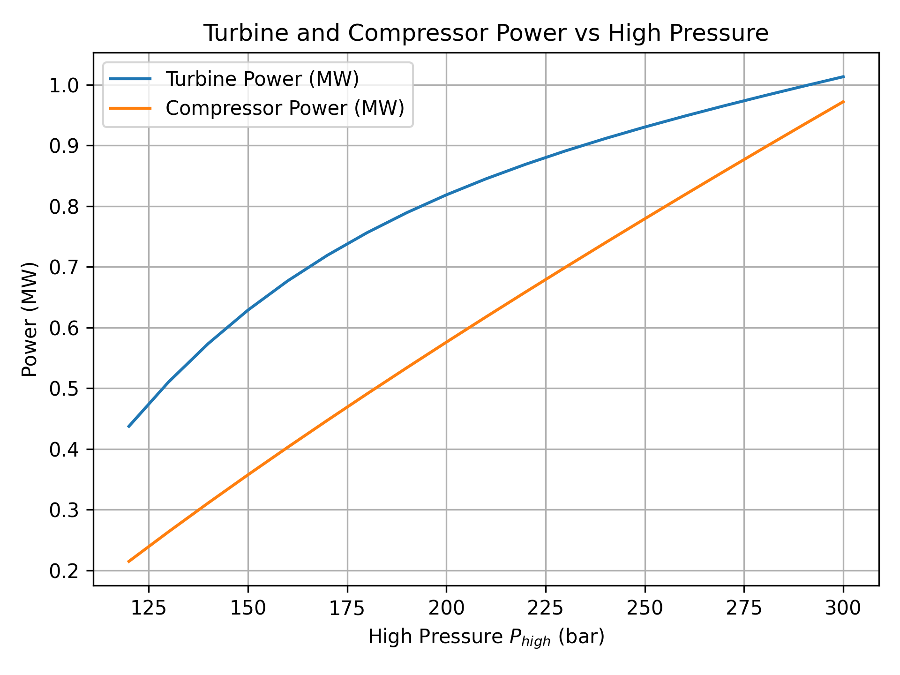

This graph explains the pressure optimum physically.

The turbine produces more power as high pressure increases, but the compressor also requires more power. Net output is determined by the difference between those two trends.

---

# 3. Two Dimensional Pressure Optimization

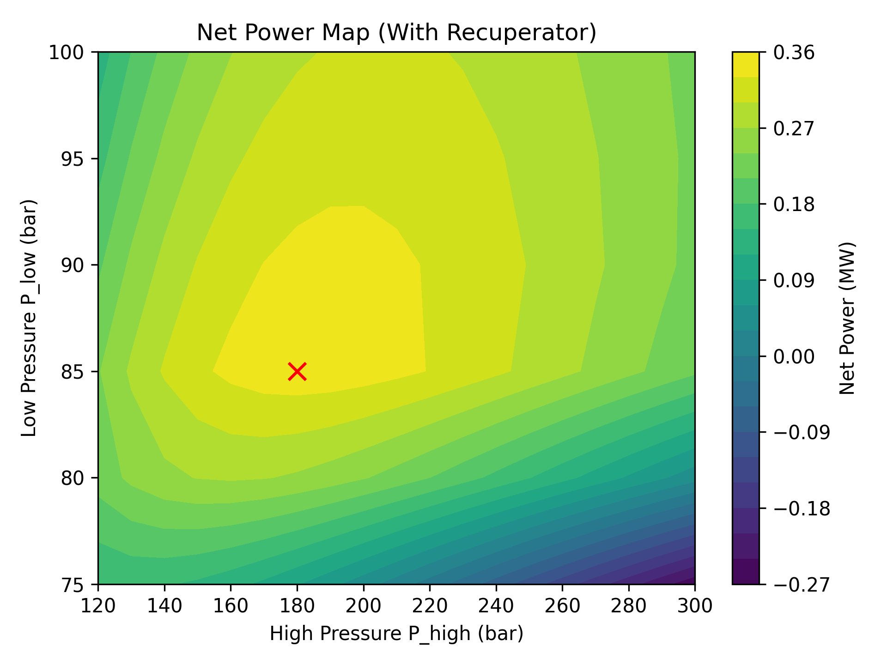

The two dimensional pressure map evaluates both low pressure and high pressure.

This is more representative of an engineering design study than optimizing only one variable, because it exposes a full operating region rather than a single sensitivity curve.

The scripts also distinguish between:

**maximum net power**

and

**maximum thermal efficiency**

which are not necessarily located at the same operating point.

---

# 4. Recuperator Performance

## Thermal efficiency benefit

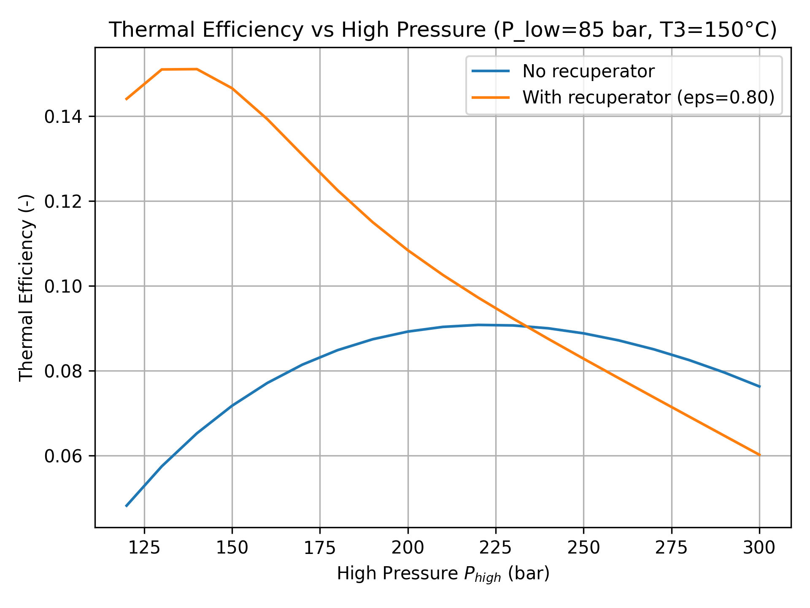

The recuperator mainly improves thermal efficiency by reducing the external geothermal heat required to reach turbine inlet temperature.

## Geothermal heat input reduction

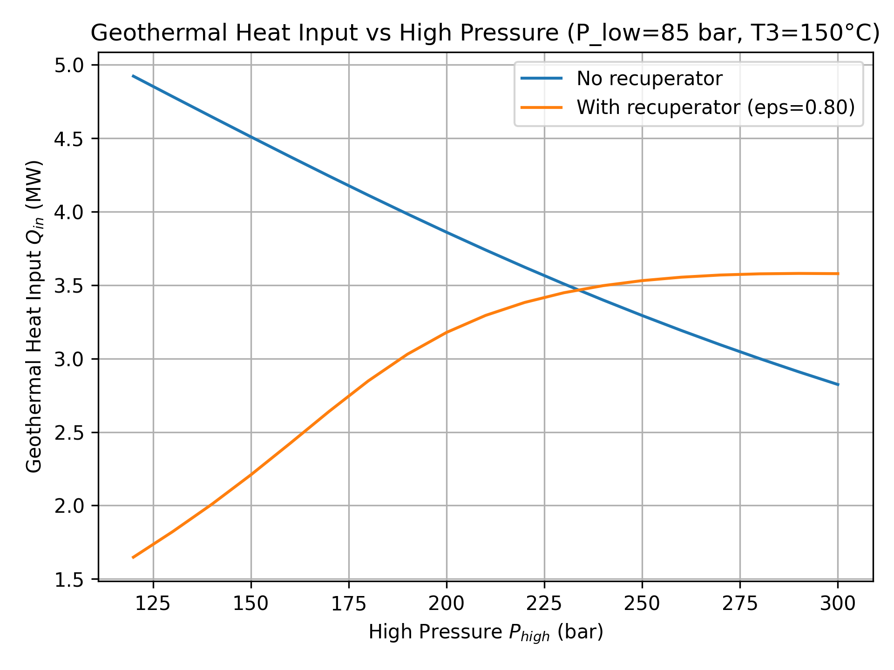

In the simplified cycle model, the recuperator does not significantly alter compressor and turbine shaft work because pressure losses are neglected.

Its main effect is therefore:

```text
lower external geothermal heat input
higher thermal efficiency
```

---

## Recuperator Feasibility

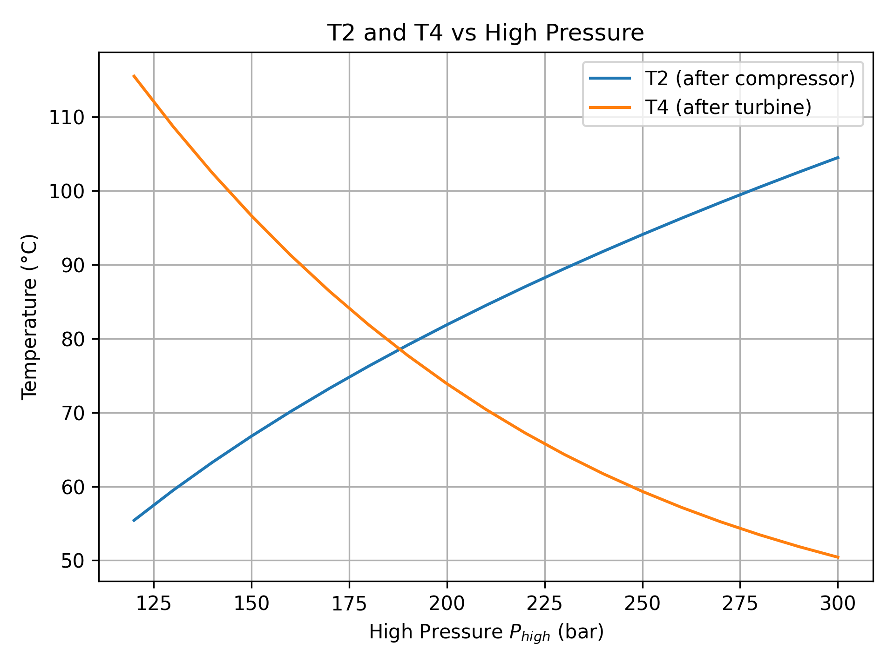

The compressor outlet temperature rises with high pressure, while turbine outlet temperature decreases.

The crossover between `T2` and `T4` defines an important physical limit.

When:

```text
T4 <= T2
```

the turbine exhaust cannot preheat the compressed stream in a conventional recuperator.

The cleaned model therefore disables recuperation in this region.

---

# 5. Mass Flow Sensitivity

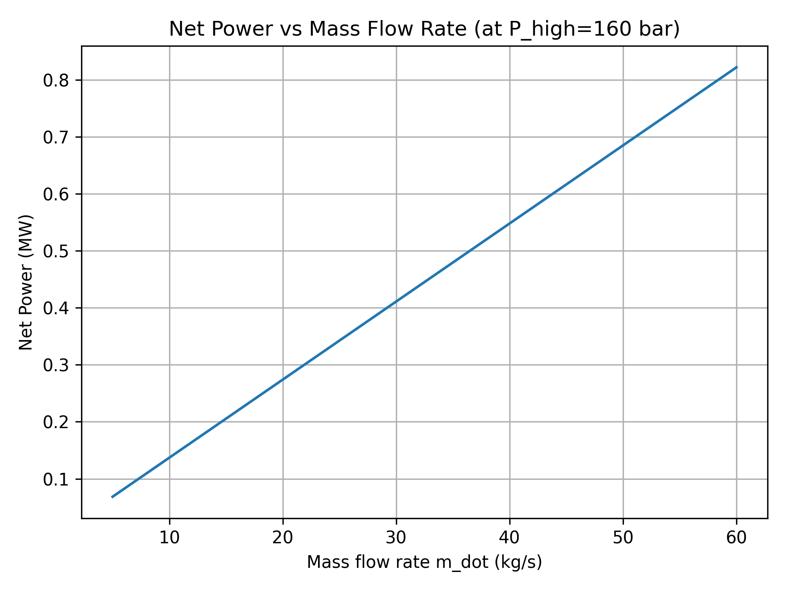

At fixed thermodynamic state points, specific cycle work remains approximately constant.

Therefore:

```text
W_net ∝ m_dot
```

and the total plant power scales almost linearly with CO₂ mass flow.

This result is useful for capacity scaling.

---

# 6. Quasi Steady Start Up Analysis

The project includes a simplified start up model where pressure, turbine inlet temperature and mass flow are ramped with exponential first order responses.

Approximate 95 percent response times are:

| Variable | Approximate time |
| --- | ---: |
| High pressure | 45 min |
| Turbine inlet temperature | 60 min |
| Mass flow | 30 min |

## Net power response

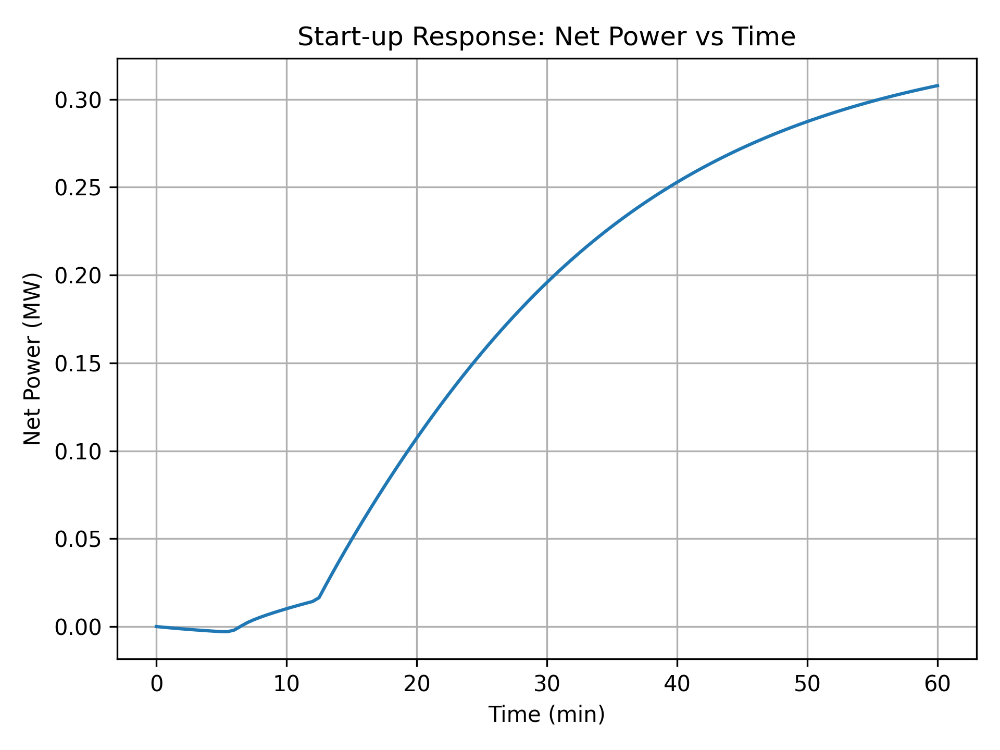

The cycle initially consumes more compressor work than it produces from expansion. Useful net generation appears only after pressure, temperature and mass flow increase sufficiently.

## Geothermal heat input response

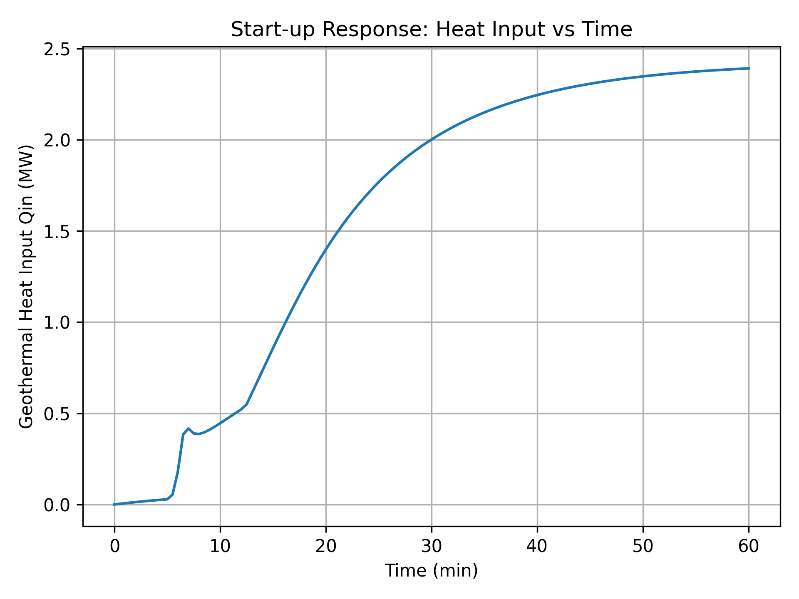

The geothermal heat requirement rises as the cycle approaches its design state.

### Important interpretation

This is a **quasi steady** start up model.

It does not include:

* shaft inertia
* heat exchanger metal thermal mass
* transient CO₂ inventory
* distributed component energy balances

The model is therefore best interpreted as a first engineering approximation of start up behaviour.

---

# 7. PV Resource Model

Hourly PV generation is obtained from **PVGIS** through `pvlib`.

Reference PV assumptions:

| Parameter | Value |
| --- | ---: |
| PV capacity | 1.0 MWp |
| Performance ratio | 0.85 |
| Tilt | 30° |
| Azimuth | 180° |
| Location used in the model | Nürnberg |

The hourly PV output is used as an input to the hybrid dispatch model.

---

# 8. Hybrid Geothermal PV Battery Dispatch

The electrical dispatch follows this priority:

```text
1. Geothermal generation supplies load
2. PV supplies remaining load
3. PV surplus charges battery
4. Battery discharges during deficit
5. Remaining deficit is imported from grid
6. Remaining PV surplus is curtailed
```

Reference scenario:

| Parameter | Value |
| --- | ---: |
| Geothermal generation | 0.24 MW |
| Electrical demand | 0.30 MW |
| Battery energy | 8.0 MWh |
| Battery power | 0.20 MW |
| Charge efficiency | 0.95 |
| Discharge efficiency | 0.95 |

The battery has a nominal energy to power duration of:

```text
8.0 MWh / 0.20 MW = 40 h
```

This battery is a **scenario case**, not an optimized storage size.

---

## Hybrid First Week Power

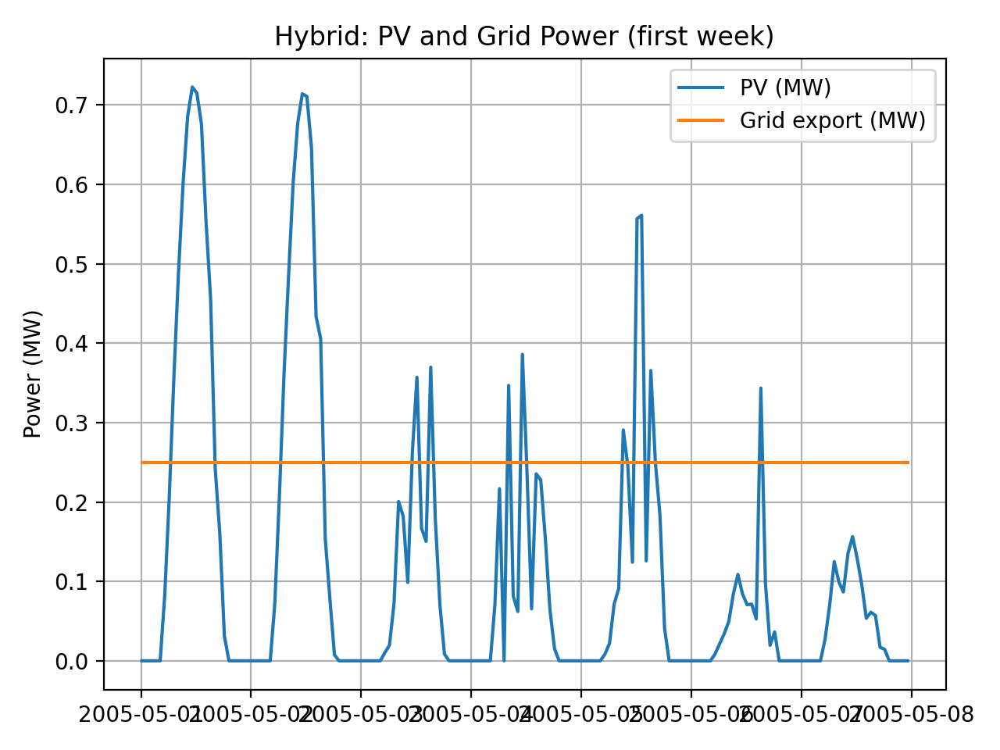

This figure shows how variable PV generation interacts with the geothermal baseload over a representative week.

## Battery State of Charge

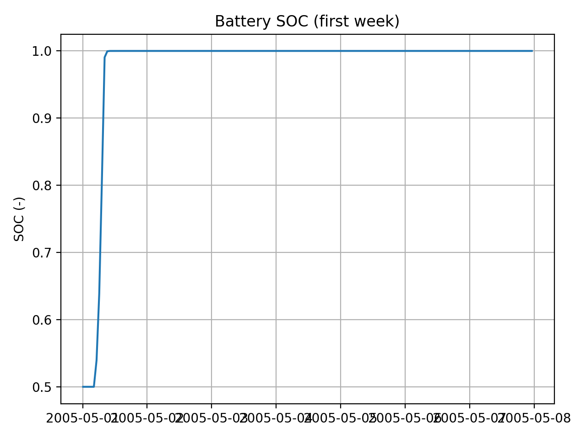

Battery SOC provides a direct check of whether the storage dispatch logic is behaving physically.

## PV Curtailment

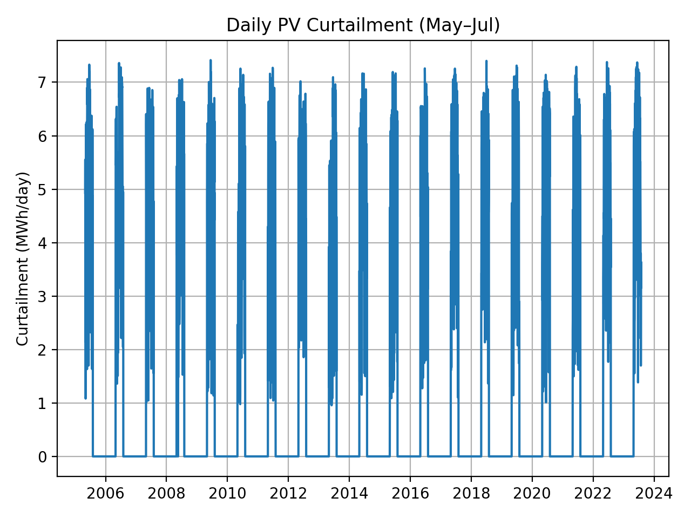

Curtailment quantifies renewable energy that cannot be used by the load or stored in the battery.

This is an important indicator for future storage sizing optimization.

---

# 9. Key Engineering Findings

### Pressure optimization

The sCO₂ cycle has a finite optimum pressure range because turbine work and compressor work respond differently to increasing pressure ratio.

### Recuperation

Recuperation primarily reduces geothermal heat demand and raises thermal efficiency.

### Recuperator feasibility

Recuperation is only physically useful while the turbine exhaust remains hotter than the compressor outlet.

### Mass flow

Mass flow acts mainly as a plant capacity scaling variable when thermodynamic state points are fixed.

### Start up

Useful power generation appears only after sufficient pressure, temperature and mass flow have developed.

### Hybridization

Dispatchable geothermal generation complements variable PV, while the battery reduces short term mismatch between renewable supply and electrical demand.

### Curtailment

PV curtailment identifies where renewable generation exceeds immediate demand and storage capability, making it a useful metric for future battery optimization.

---

# 10. Repository Structure

```text
geothermal_sco2_hybrid_energy_system

src/
    thermo_components.py
    cycle_model.py
    pressure_sweep.py
    pressure_map.py
    off_design_and_startup.py
    pv_model.py
    hybrid_dispatch.py
    run_thermodynamic_studies.py

data/
    model_parameters.csv
    derived_metrics.csv

figures/
    selected_graphs/
    original_results/
    portfolio/

docs/
    model_equations.md
    assumptions.md
    engineering_review.md
    future_work.md

archive/
    original_scripts/

README.md
requirements.txt
.gitignore
```

---

# 11. Run the Project

Install dependencies:

```bash
pip install -r requirements.txt
```

Run the main thermodynamic studies:

```bash
python src/run_thermodynamic_studies.py
```

Generate PV data:

```bash
python src/pv_model.py
```

Run hybrid dispatch after PV data is available:

```bash
python src/hybrid_dispatch.py
```

---

# 12. Engineering Skills Demonstrated

| Engineering area | Project evidence |
| --- | --- |
| Thermodynamics | Real CO₂ property calculations with CoolProp |
| Turbomachinery | Compressor and turbine performance models |
| Brayton cycles | Net work, heat input and efficiency |
| Heat recovery | Recuperator effectiveness and feasibility |
| Optimization | One and two dimensional pressure searches |
| Off design analysis | Pressure, temperature and flow sensitivities |
| Start up analysis | Quasi steady ramp modelling |
| Solar energy | PVGIS and pvlib based hourly generation |
| Energy storage | Battery SOC and dispatch |
| Hybrid systems | Geothermal, PV, battery and grid interaction |
| Python | Modular engineering workflow |
| Technical communication | Engineering plots, maps and documentation |

---

# 13. Model Limitations

The portfolio intentionally distinguishes between what is modelled and what is not.

The current model does not yet include:

* pressure losses in heat exchangers
* component efficiency maps
* exergy destruction by component
* geothermal brine side heat exchanger design
* pinch point optimization
* battery degradation
* optimized battery sizing
* full transient component thermal inertia
* full techno economic analysis

These are documented as future work rather than silently assumed.

---

# Future Development

Recommended next steps:

1. Exergy analysis
2. Heat exchanger pinch analysis
3. Pressure loss modelling
4. Battery size optimization
5. Economic dispatch
6. Levelized cost of electricity
7. Recompression sCO₂ cycle comparison
8. Full transient plant model

---

# Author

## Nadeem Raza

M.Sc. Clean Energy Processes

Focus areas include thermodynamic modelling, renewable energy integration, energy storage and Python based engineering analysis.
